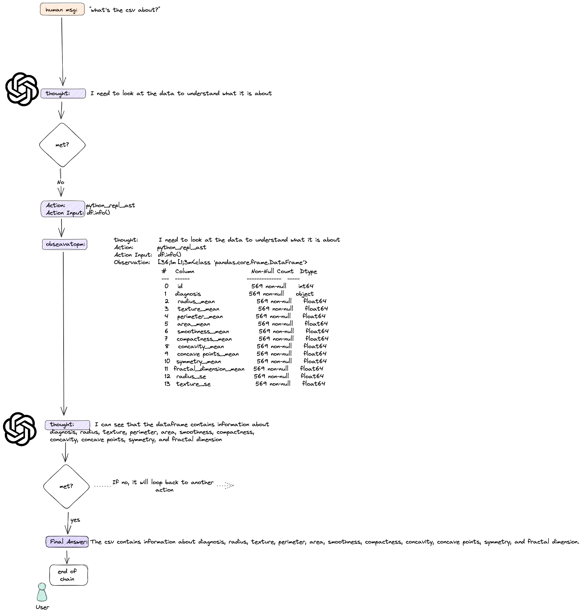

# Chat with csv
---

## Introduction

langchain `agent` is a wrapper around model. It is illustrated in the figure below,




> 可以把agent当作一个adaptive reasoning model来决定该用怎么样的chains, 而不是hardcode chain该串联还是并联在代码里面.

During the reasoning process, it went through the follow stages:
- `thought`: the agent is reasoning 然后根据reason出来的逻辑，去toolkits里面选择对应的tool, 并且设计一个chain
- `action` and `action input`: 根据设计的chain, 调用不同的tool, 并把tool的output作为下一个tool的input, 不管中间intermediate results, 输出最终的结果，叫做observation
- `observation`: 最终输出的结果, 反馈给agent进行下一步`thought`, 如果agent觉得good enough, 会输出结果，如果agent觉得不够好，会继续`thought-action-observation`直到设定的最大次数

> 有些时候，user问的问题比较刁钻，需要用到一些不在venv环境下的包，该如何规避比较好? error handling?

## Installation

With `Python 3.10.8`, please run
```bash
pip install -r requirements.txt
```

## usage

To run the module, please use
```bash
streamlit run src/main.py 
```


# Reference

- [longChain Agents Doc](https://python.langchain.com/docs/modules/agents/)
  - agent is a wrapper around model
- [Follow-along](https://www.youtube.com/watch?v=tjeti5vXWOU&list=PLMVV8yyL2GN_n41v1ESBvDHwMbYYhlAh1&index=8&ab_channel=AlejandroAO-Software%26Ai)
  - this repo is a follow-along with the video.
- [CSV Agent langchain tutorial](https://python.langchain.com/docs/integrations/toolkits/csv)
